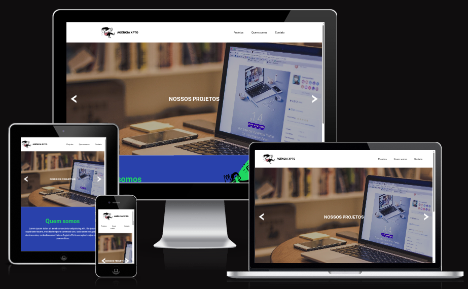

# 🌐 Agência XPTO  

Projeto desenvolvido durante o curso **DevQuest** da [Dev em Dobro]. 🚀 
A proposta foi criar uma **landing page de uma agência digital**, praticando HTML, CSS e JavaScript de forma simples e objetiva.  

---

## ✨ O que tem nesse projeto  

- **Layout responsivo** 📱💻  
- **Menu de navegação** com links entre as seções  
- **Carrossel de projetos** com botões de avançar e voltar  
- **Seção "Quem somos"** para apresentar a agência  
- **Rodapé com redes sociais** e copyright  

---

## 🛠️ Tecnologias usadas  

- HTML5  
- CSS3 (responsividade + animações básicas)  
- JavaScript (carrossel de imagens)  
- Google Fonts + Font Awesome  

---

## 💡 Aprendizados  

Esse projeto me ajudou a:  
- Treinar a construção de **carrossel de imagens** em JavaScript.  
- Melhorar a organização de uma landing page.  
- Reforçar a importância de **comentários no código**, que facilitam revisitar o projeto depois.  

---

## 🤝 Créditos  

Projeto do curso **DevQuest- Dev em Dobro**. 
Feito  por mim para praticar o código e aplicar o aprendizado.💜

✨ Um passo de cada vez, sempre aprendendo.
